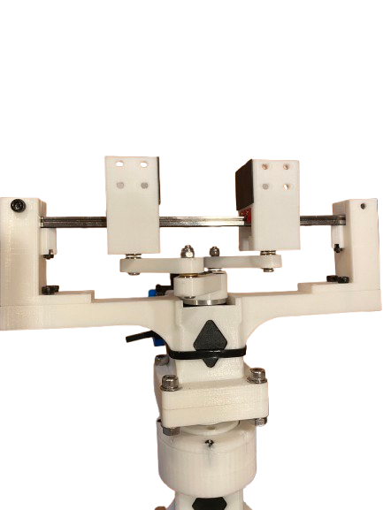

  <header class="animate-section" style="text-align: center; margin-bottom: 80px;">
    <h1 style="font-size: 4.5rem; font-weight: 800; color: #1e3a8a; margin-bottom: 10px; letter-spacing: -0.06em;">
      sGRIPPER v.1
    </h1>
    
BY SANATAN SINHA

  </header>

  

    <section class="project-card">
      <h2>Project Overview</h2>
      
      

        
      

      

        The <b>sGRIPPER v.1</b> is a specialized high-performance robotic end-effector engineered to solve the common pitfalls of traditional 3D-printed and hobbyist grippers. While most low-cost grippers rely on flimsy geared pivots that suffer from immense backlash, the sGRIPPER utilizes an <b>industrial-grade MGN 7 linear rail</b> as its primary guidance system. 
          
        This design choice ensures that the fingertips remain perfectly parallel throughout the entire stroke, eliminating the "skewing" effect seen in cheaper rack-and-pinion or pivot-based designs.
      

      <h3>Why Cam-Based Actuation?</h3>
      

        At the heart of the sGRIPPER v.1 is a custom <b>cam-based actuation mechanism</b>. Unlike standard direct-drive grippers where the motor stalls against the object, the cam profile is mathematically optimized to provide a <b>mechanical advantage</b> that increases as the gripper closes. 
          
        This allows for significantly higher gripping forces with a smaller motor footprint. Furthermore, the cam system inherently provides <b>self-locking characteristics</b>, meaning the gripper can maintain its hold even if power is modulated, preventing the accidental drop of payloads.
      

      <h3>Superiority Over Conventional Designs</h3>
      

        Most robotic grippers utilize plastic-on-plastic sliding surfaces which create friction and wear over time. By integrating the <b>MGN 7 stainless steel rail</b>, the sGRIPPER v.1 achieves near-zero friction movement. 
          
        <b>Key Advantages:</b>
        <ul>
          <li><b>High Precision:</b> The MGN 7 rail provides micron-level accuracy, ensuring repeatable picking of tiny components.</li>
          <li><b>Durability:</b> Steel-on-steel ball bearing movement outlasts traditional geared pivots by a factor of 10x.</li>
          <li><b>Stability:</b> The wide carriage of the rail absorbs side-loading forces, preventing the fingers from twisting when lifting heavy or off-center objects.</li>
        </ul>
      

      

        <a href="https://sanrobo206.github.io" class="cta-button">RETURN TO PROJECT HUB</a>
      

    </section>
  

  <footer class="animate-section" style="margin-top: 150px; text-align: center; color: #1e40af; font-size: 1rem; padding-bottom: 60px; text-transform: uppercase; letter-spacing: 3px;">
    Created by Sanatan Sinha
  </footer>

